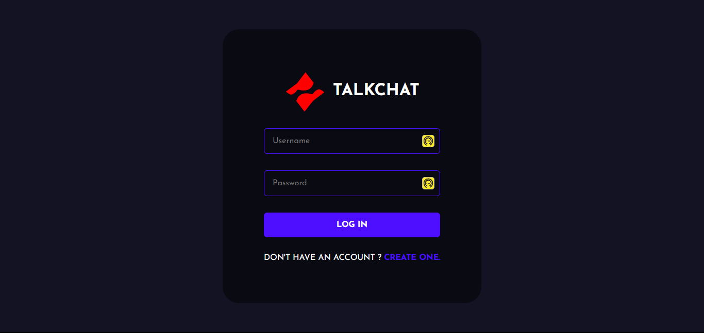
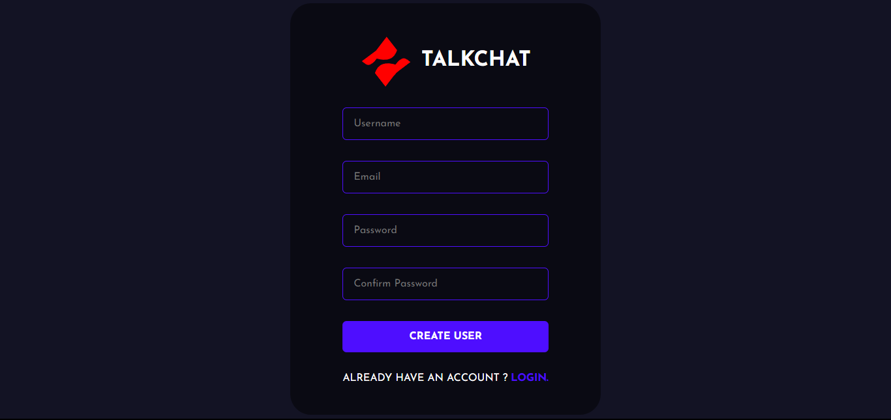
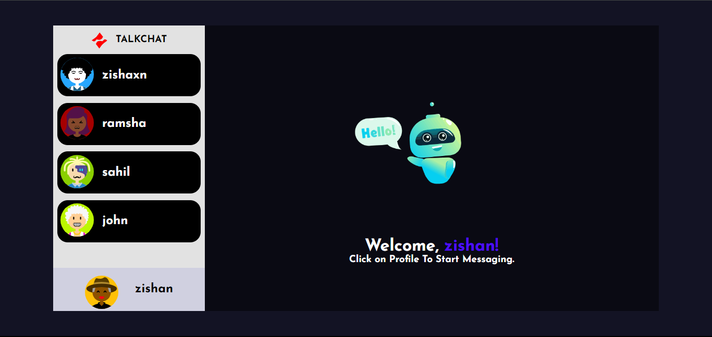
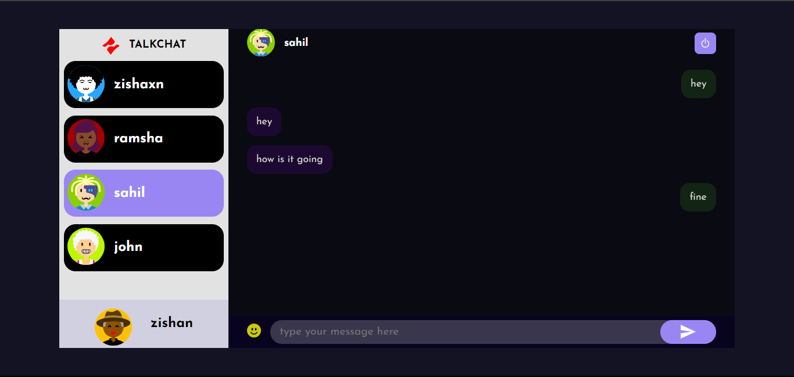

# TalkChat - Chat Application

TalkChat is a real-time chat application built with the MERN (MongoDB, Express, React, Node.js) stack.









## Table of Contents

- [Demo](#demo)
- [Installation](#installation)
  - [Requirements](#requirements)
  - [Server Setup](#server-setup)
  - [Client Setup](#client-setup)
- [Usage](#usage)
- [Features](#features)

## Demo

Watch the demo video [here](./path/to/demo.mp4).

## Installation

### Requirements

Make sure you have the following prerequisites installed:

- [Node.js](https://nodejs.org/en/download)
- [MongoDB](https://www.mongodb.com/docs/manual/administration/install-community/)

Both should be installed, and make sure MongoDB is running.

### Server Setup

1. Navigate to the `server` directory:

   ```shell
   cd server
   ```

2. Install dependencies:

   ```shell
   npm install
   ```

3. Create a `.env` file and add the required configurations:

   ```env
   MONGO_URL=<your_mongo_db_url>
   PORT=<your_server_port>
   ```

4. Start the server:

   ```shell
   npm start
   ```

### Client Setup

1. Navigate to the `client` directory:

   ```shell
   cd client
   ```

2. Install dependencies:

   ```shell
   npm install
   ```

3. Create a `.env` file and add the required configurations:

   ```env
   REACT_APP_HOST=<your_server_url>
   ```

4. Start the React app:

   ```shell
   npm start
   ```

## Usage

To use the chat application, register an account, log in, and start chatting with other users.

## Features

- Real-time messaging
- User registration and authentication
- Avatar customization
- Logout functionality

### Happy Coding 🚀

